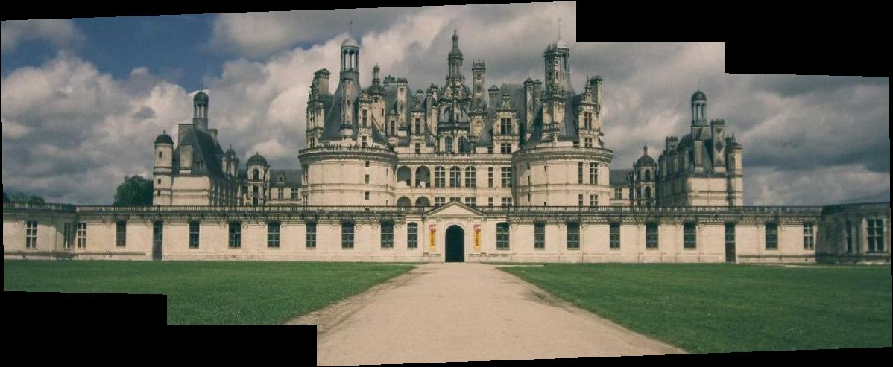

# Image Warping and Mosaicing

CS 180 Project 3. Recover the full **projective** relationship between
overlapping photos, warp them into a common frame, and blend them into one
seamless panorama  first from hand-clicked points, then fully automatically
with Harris corners, MOPS descriptors and RANSAC. Follow-up to Project 1, which
aligned images by translation only.

**[→ Read the writeup](writeup.html)**  every result with its explanation.
(Open the file locally; GitHub won't render HTML in-page.)



## Quick start

```bash
python -m venv .venv
.venv/Scripts/activate            # Windows;  source .venv/bin/activate on Unix
pip install -r requirements.txt

python make_data.py               # build the input image sets into data/
python run_all.py                 # every part -> results/ + results/summary.json
python make_writeup.py            # rebuild writeup.html
```

The whole pipeline runs in about 50 seconds. Correctness of the geometry core is
proven independently of any image:

```bash
python test_homography.py         # recover a known H, warp/unwarp round-trip
python test_warp.py               # identity, translation, bilinear-exact-on-ramp
```

## What each part does

**A.2 Homographies**  `computeH` sets up two linear equations per
correspondence and solves the over-determined system by least squares
(`np.linalg.lstsq`). Recovers a known H from synthetic points to ~1e-8.

**A.3 Warping + rectification**  inverse warping with nearest-neighbour and
bilinear samplers (`warp.py`). Rectification declares a plane's four corners to
be a rectangle and warps it fronto-parallel (a laptop screen, a Bruges facade).

**A.4 Mosaics**  warp all views into a shared canvas and feather-blend
(weights ramp to zero at each photo's edge). Three manual panoramas, each shown
against the naive last-writer-wins composite so the seam removal is visible.

**B.1 Harris + ANMS** — `harris.py` (provided) finds thousands of corners;
Adaptive Non-Maximal Suppression keeps 500 that are strong *and* spread out.

**B.2/B.3 Descriptors + matching**  40×40 windows sampled to normalised 8×8
patches, matched by nearest neighbour with Lowe's ratio test.

**B.4 RANSAC**  4-point RANSAC fits a robust homography, then auto-stitches
using the exact same warp/blend as Part A. Auto mosaics are shown side by side
with the manual ones.

## Data provenance

There is no hand-shot dataset here. Each set is synthesised from **one wide real
photograph** (Unsplash imagery via picsum.photos) by re-projecting overlapping
sub-windows through *known* homographies  the image-formation model of a camera
pivoting in place. This gives real texture, guaranteed overlap, no black
borders, and an **exact ground-truth H**, so the recovered homographies are
checked against truth in `results/summary.json` (they land sub-pixel). The two
rectification images are genuinely oblique photos. `make_data.py` regenerates
everything from the five source images in `data/sources/`.

## Files

| | |
|---|---|
| `homography.py` | `computeH` (least-squares DLT) + `apply_H` |
| `warp.py` | inverse warp: nearest + bilinear, output bounding box |
| `rectify.py` | A.3 rectification |
| `mosaic.py` | warp-into-canvas + feather / naive blend, reused by A and B |
| `corners.py` | Harris (starter) + ANMS |
| `features.py` | descriptors + Lowe-ratio matching |
| `ransac.py` | 4-point robust homography |
| `autostitch.py` | Part B end-to-end |
| `make_data.py` | build input sets + ground-truth H + correspondence JSON |
| `run_all.py` | run everything → `results/` + `summary.json` |
| `make_writeup.py` | build `writeup.html` |
| `harris.py` | provided starter (Harris detector + `dist2`) |

Rubric constraints honoured: the geometry is implemented from scratch — no
`cv2.findHomography` / `warpPerspective` / `getPerspectiveTransform`, no
`skimage.transform.warp` / `ProjectiveTransform`, no `scipy.interpolate.griddata`.
Only `np.linalg` solves the homography system.
